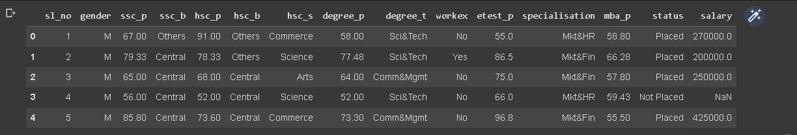
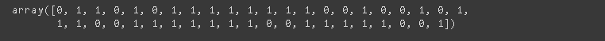
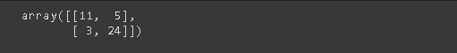
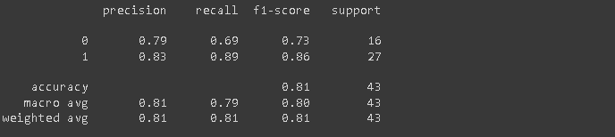

# Implementation-of-Logistic-Regression-Model-to-Predict-the-Placement-Status-of-Student

## AIM:
To write a program to implement the the Logistic Regression Model to Predict the Placement Status of Student.

## Equipments Required:
1. Hardware – PCs
2. Anaconda – Python 3.7 Installation / Jupyter notebook

## Algorithm
1. Import the standard libraries.
2. Upload the dataset and check for any null or duplicated values using .isnull() and .duplicated() function respectively.
3. Import LabelEncoder and encode the dataset.
4. Import LogisticRegression from sklearn and apply the model on the dataset.
5. Predict the values of array.
6. Calculate the accuracy, confusion and classification report by importing the required modules from sklearn.
7. Apply new unknown values


## Program:
```
/*
Program to implement the the Logistic Regression Model to Predict the Placement Status of Student.
Developed by: HEMANTH KUMAR B
RegisterNumber:  212220040047
*/

import pandas as pd
data = pd.read_csv('Placement_Data.csv')
data.head()
data1= data.copy()
data1 = data1.drop(["sl_no","salary"],axis=1)
data1.head()
data1.isnull().sum()
data1.duplicated().sum()
from sklearn.preprocessing import LabelEncoder
le = LabelEncoder()
data1["gender"] = le.fit_transform(data1["gender"])
data1["ssc_b"] = le.fit_transform(data1["ssc_b"])
data1["hsc_b"] = le.fit_transform(data1["hsc_b"])
data1["hsc_s"] = le.fit_transform(data1["hsc_s"])
data1["degree_t"] = le.fit_transform(data1["degree_t"])
data1["workex"] = le.fit_transform(data1["workex"])
data1["specialisation"] = le.fit_transform(data1["specialisation"])
data1["status"] = le.fit_transform(data1["status"])
data1
x=data1.iloc[:,:-1]
x
y = data1["status"]
y
from sklearn.model_selection import train_test_split
x_train,x_test,y_train,y_test = train_test_split(x,y,test_size=0.2,random_state=0)
from sklearn.linear_model import LogisticRegression
lr = LogisticRegression(solver="liblinear")
lr.fit(x_train,y_train)
y_pred = lr.predict(x_test)
y_pred
from sklearn.metrics import accuracy_score 
accuracy = accuracy_score(y_test,y_pred) 
accuracy 
from sklearn.metrics import confusion_matrix 
confusion = confusion_matrix(y_test,y_pred) 
confusion
from sklearn.metrics import classification_report 
classification_report1 = classification_report(y_test,y_pred) 
print(classification_report1)
lr.predict([[1,80,1,90,1,1,90,1,0,85,1,85]])
```

## Output:









## Result:
Thus the program to implement the the Logistic Regression Model to Predict the Placement Status of Student is written and verified using python programming.
